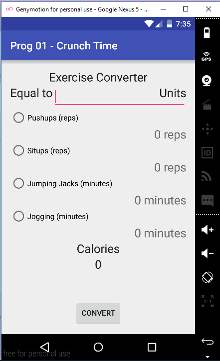
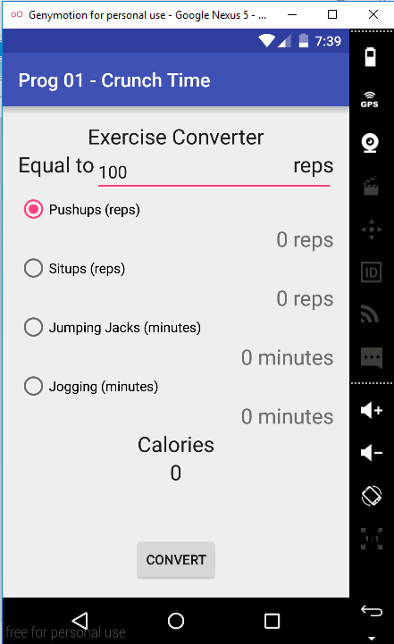
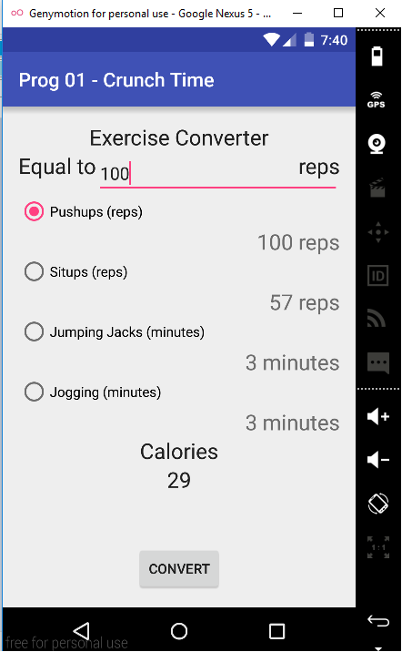

# PROG 01: Crunch Time

Crunch Time is an excersize conversion app - for a given exercise and workout intensity, it will tell you the number of calories burned and and equivalent workouts for different types of exercise.

## Authors

Kevin Baum ([link.kb@berkeley.edu](mailto:link.kb@berkeley.edu))

## Demo Video

See [the demo video] (https://youtu.be/KTMArtgpBYk)

## Screenshots

You can start by choosing an exercise from the radio buttons center screen.

Then you enter the intensity of your workout in the defined units

And then after hitting the Convert button, the calories burned and equivalent workouts are displayed.

## Acknowledgments

* Hat tip to anyone who's code was used
* Any other support
Hat tip to Google and how the first result for "how to make [x] do [y] in android studio" was always an excellent demonstration.

*Feel free to enhance your README. For Markdown syntax, see [the GitHub Guides](https://guides.github.com/features/mastering-markdown/). Remove this line in your submission.*
